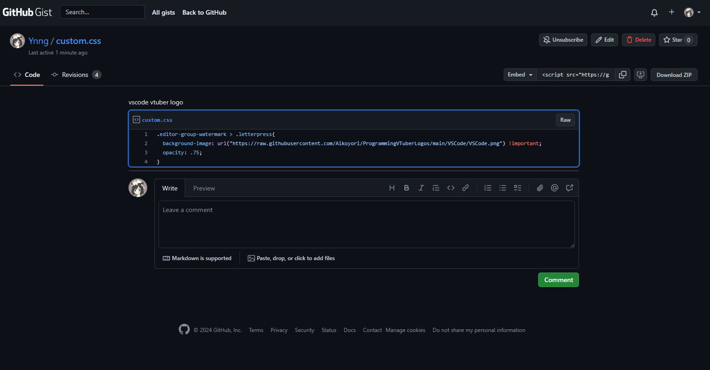
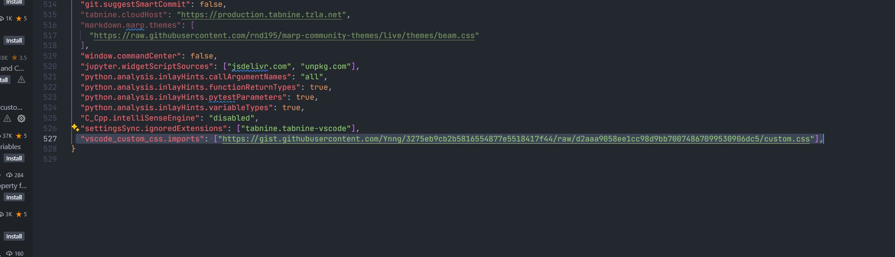

# custom.css
custom.css on vscode

在 github gist 上寫了一個簡短的 css 片段，並使用此擴展載入到 vscode 中
https://t.co/YQzUHqMxrD
安裝擴展程式並打開setting.json 粘貼 vscode_custom_css.imports [“ ”]

參考: https://x.com/PrunusSpeciosa_/status/1781241673525170535